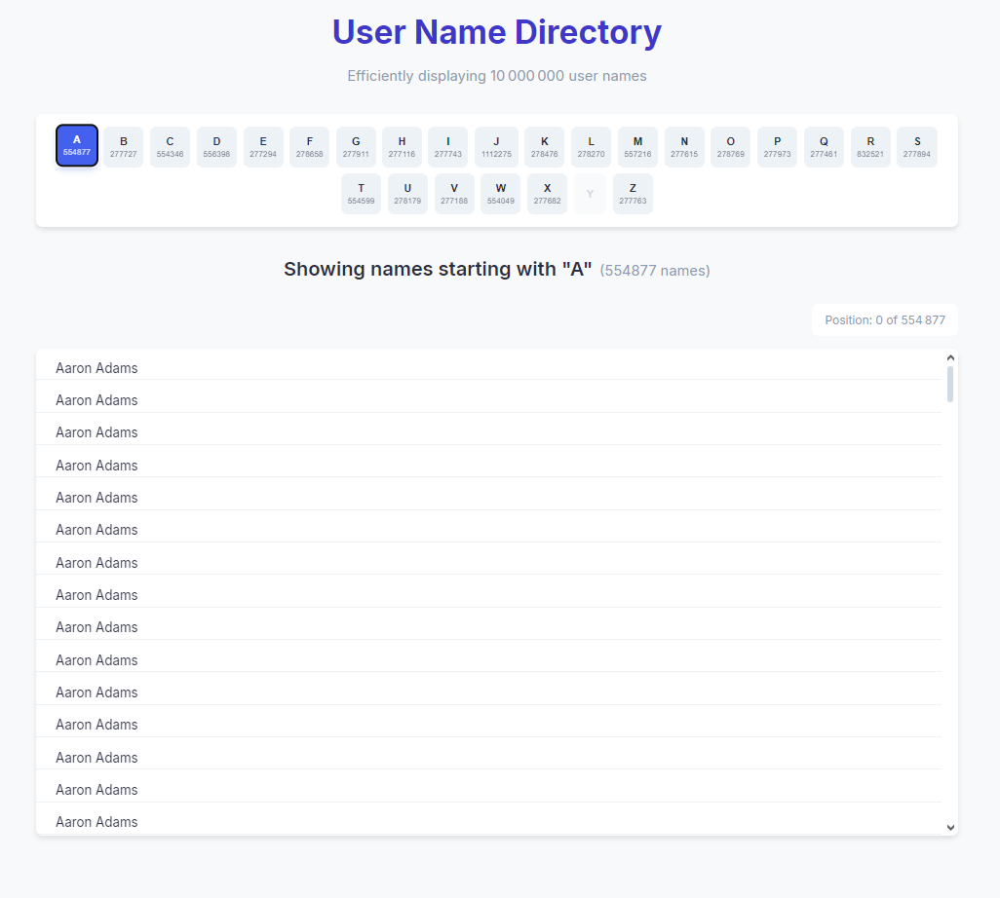

# User Name Directory

A high-performance web application for displaying and navigating through a large dataset of user names (10 million+) with efficient pagination, virtualized rendering, and alphabetical navigation.



## 🎥 Demo

https://github.com/user-attachments/assets/1b7f63a1-67d9-4ea5-a4fe-ecf1631c9e7f

## 🚀 Features

* **Efficient handling of 10 million+ user names**
* **Alphabetical navigation with letter counts**
* **Virtualized scrolling with on-demand data loading**
* **Responsive design for all device sizes**
* **Server-side data pagination and caching**
* **Position tracking within large datasets**

## 📋 Table of Contents

* [Installation](#-installation)
* [Usage](#-usage)
* [Architecture Overview](#-architecture-overview)
* [Key Concepts](#-key-concepts)
* [Performance Optimizations](#-performance-optimizations)
* [API Endpoints](#-api-endpoints)
* [Technical Stack](#-technical-stack)
* [Future Improvements](#-future-improvements)

## 🔧 Installation

### Prerequisites

* Node.js (v14+)
* Docker for PostgreSQL (v12+) container
* npm or yarn

### Backend Setup

1. Clone the repository:

```bash
git clone https://github.com/Abdellatif-EK/Technical-Test-Users-Names.git
cd Technical-Test-Users-Names
```

2. Install backend dependencies:

```bash
cd Backend
npm install
```

3. Configure environment variables (optional):
   Create a `.env` file in the server directory with the following variables:

```
DB_USER=postgres
DB_HOST=localhost
DB_NAME=namesdb
DB_PASSWORD=postgres
DB_PORT=5432
PORT=5000
```

4. Set up PostgreSQL database using Docker Compose:

```bash
docker-compose up -d 
```

### Frontend Setup

1. Install frontend dependencies:

```bash
cd ../Frontend
npm install
```

## 🚀 Usage

### Starting the Backend Server

```bash
cd Backend
node generate-file.js
node Db.js
node Server.js
```

The server will:

1. Initialize the database tables if they don't exist
2. Check if user data needs to be imported
3. Build the alphabet index cache for efficient navigation
4. Start listening on port 5000 (or your configured PORT)

### Starting the Frontend Application

```bash
cd Frontend
npm start
```

The React application will start and open in your default browser at `http://localhost:3000`.

### Data Generation

The application can generate test data (10 million users by default) using the script generate-file.js.

## 🏗️ Architecture Overview

The application uses a client-server architecture:

### Backend (Node.js + Express + PostgreSQL)

* **Express.js server** for handling HTTP requests
* **PostgreSQL database** for storing and querying user names
* **In-memory caching** for alphabet index positions
* **Batch processing** for handling large data imports
* **Efficient pagination** with indexed database queries

### Frontend (React)

* **React** for building the user interface
* **react-window** for virtualized rendering
* **react-window-infinite-loader** for infinite scrolling
* **Axios** for HTTP requests
* **Debounced requests** for optimized data loading
* **Alphabet navigation** for quick access to sections of data

## 💡 Key Concepts

### 1. Virtual List Rendering

Instead of rendering all 10 million names at once (which would crash the browser), the application uses `react-window` to create a "virtualized" list that only renders the items currently visible on screen (around 15-20 items), regardless of how large the actual dataset is.

```jsx
<List
  height={600}
  width="100%"
  itemCount={currentLetterCount}
  itemSize={40}
  onItemsRendered={onItemsRendered}
  onScroll={handleScroll}
>
  {Row}
</List>
```

### 2. Windowing and Infinite Loading

The application combines virtualization with infinite loading through `react-window-infinite-loader` to fetch data only when needed as the user scrolls:

```jsx
<InfiniteLoader
  isItemLoaded={isItemLoaded}
  itemCount={currentLetterCount}
  loadMoreItems={debouncedLoadItems}
  threshold={500}
>
  {/* List component */}
</InfiniteLoader>
```

### 3. Efficient Database Querying

The database schema is optimized with indexes for fast lookups:

```sql
CREATE TABLE IF NOT EXISTS users (
  id SERIAL PRIMARY KEY,
  name VARCHAR(100) NOT NULL,
  first_letter CHAR(1) NOT NULL
);

-- Create index on first_letter for faster letter-based lookups
CREATE INDEX IF NOT EXISTS idx_users_first_letter ON users(first_letter);

-- Create index on name for faster sorting
CREATE INDEX IF NOT EXISTS idx_users_name ON users(name);
```

### 4. Alphabet Navigation Optimization

To enable quick jumping to sections of the alphabet, the application builds a cache of starting positions for each letter:

```javascript
async function buildAlphabetCache() {
  // Get the start position for each letter
  const { rows } = await pool.query(`
    SELECT first_letter, MIN(id) as first_id
    FROM users
    GROUP BY first_letter
    ORDER BY first_letter
  `);
  
  // Only include letters that actually have data
  rows.forEach(row => {
    const letter = row.first_letter.toUpperCase();
    if (alphabet.includes(letter) && lettersWithData[letter] > 0) {
      alphabetIndexCache[letter] = parseInt(row.first_id) - 1;
    }
  });
}
```

### 5. Batch Processing for Large Data Imports

To efficiently handle importing millions of records, the application processes data in batches:

```javascript
const batchSize = 10000;
let values = [];
let batchCounter = 0;

for await (const line of rl) {
  // Process each line
  values.push(`('${name.replace(/'/g, "''")}', '${firstLetter}')`);
  batchCounter++;
  
  if (batchCounter >= batchSize) {
    await client.query(`
      INSERT INTO users (name, first_letter) 
      VALUES ${values.join(',')}
    `);
  
    values = [];
    batchCounter = 0;
  }
}
```

### 6. Debounced API Requests

To prevent excessive API calls while scrolling, the application implements debouncing:

```javascript
const debouncedLoadItems = useCallback((startIndex, stopIndex) => {
  pendingRequestRef.current = { startIndex, stopIndex };
  
  if (debounceTimerRef.current) {
    clearTimeout(debounceTimerRef.current);
  }
  
  return new Promise(resolve => {
    debounceTimerRef.current = setTimeout(() => {
      const { startIndex, stopIndex } = pendingRequestRef.current;
      fetchUsersForLetter(currentLetter, startIndex, stopIndex).then(resolve);
    }, DEBOUNCE_TIME);
  });
}, [currentLetter, fetchUsersForLetter, alphabetIndex]);
```

## ⚡ Performance Optimizations

1. **Database Indexing** : Custom indexes on the `first_letter` and `name` columns for faster queries
2. **Data Batching** : Processing records in batches for efficient I/O operations
3. **Memory Management** : Streaming file reads to avoid loading entire datasets into memory
4. **Virtualized Rendering** : Only rendering visible items regardless of dataset size
5. **Request Caching** : Preventing duplicate API requests for the same data
6. **Debounced Loading** : Reducing API calls while scrolling
7. **Letter Navigation** : Jumping directly to positions in the dataset
8. **Server-side Pagination** : Limiting query result sizes for faster response times
9. **Efficient State Management** : Only updating necessary components on data change
10. **Transaction-based imports** : Using database transactions for safe batch operations

## 🔌 API Endpoints

### Get Users with Pagination

```
GET /api/users?start=0&limit=100
```

Parameters:

* `start`: Starting position (offset) in the dataset
* `limit`: Number of records to return (max 2000)

Response:

```json
{
  "users": ["Aaron Adams", "Adam Smith", ...],
  "total": 10000000,
  "start": 0,
  "limit": 100
}
```

### Get Alphabet Index Map

```
GET /api/alphabet-index
```

Response:

```json
{
  "alphabetIndex": {
    "A": 0,
    "B": 382911,
    ...
  },
  "letterCounts": {
    "A": 382911,
    "B": 401823,
    ...
  },
  "totalUsers": 10000000
}
```

## 🛠️ Technical Stack

### Backend

* **Node.js** : JavaScript runtime
* **Express** : Web framework
* **PostgreSQL** : Database
* **pg** : PostgreSQL client for Node.js
* **cors** : Cross-Origin Resource Sharing middleware

### Frontend

* **React** : UI library
* **react-window** : Virtualized list component
* **react-window-infinite-loader** : Infinite loading for virtualized lists
* **axios** : HTTP client
* **CSS3** : Styling with custom properties and responsive design
